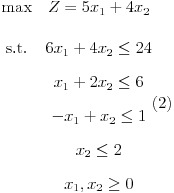

# rSimplex

A very basic implementation of the simplex algorithm to solve linear programming problems in R.

```r
devtools::install_github("mfontcada/rSimplex")
library(rSimplex)
```

### Example



```r
variables <- c("X1", "X2")
coefficients <- c(5, 4)
constraints <- matrix(c(6, 4,
                        1, 2,
                        -1, 1,
                        0, 1),
                      ncol = length(variables), byrow = TRUE)
rhs <- c(24, 6, 1, 2)
sense <- c("<=", "<=", "<=", "<=")
type <- "maximize"

sol <- simplex(variables, coefficients, constraints, rhs, sense, type)
```
